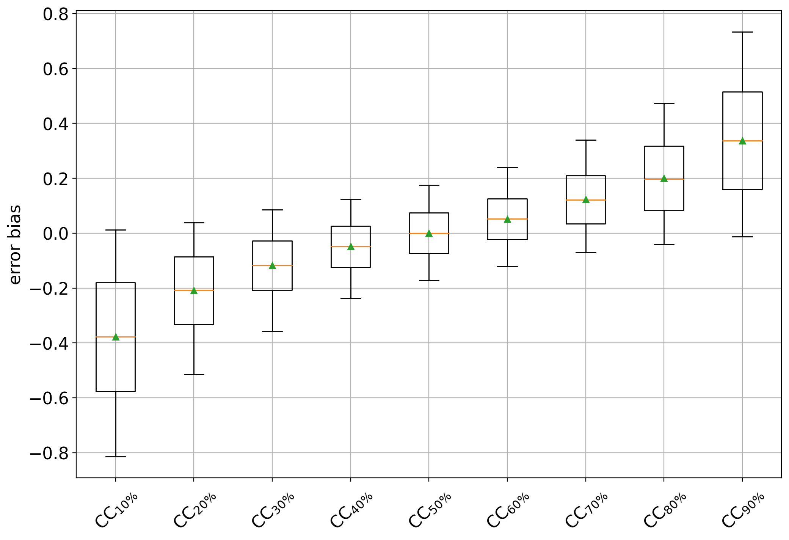

# Plotting

The module _qp.plot_ implements some basic plotting functions
that can help analyse the performance of a quantification method.

All plotting functions receive as inputs the outcomes of 
some experiments and include, for each experiment, 
the following three main arguments:

* _method_names_ a list containing the names of the quantification methods
* _true_prevs_ a list containing matrices of true prevalences
* _estim_prevs_ a list containing matrices of estimated prevalences 
(should be of the same shape as the corresponding matrix in _true_prevs_)

Note that a method (as indicated by a name in _method_names_) can
appear more than once. This could occur when various datasets are
involved in the experiments. In this case, all experiments for the
method will be merged and the plot will represent the method's
performance across various datasets.

This is a very simple example of a valid input for the plotting functions:
```python
method_names = ['classify & count', 'EMQ', 'classify & count']
true_prevs = [
    np.array([[0.5, 0.5], [0.25, 0.75]]),
    np.array([[0.0, 1.0], [0.25, 0.75], [0.0, 0.1]]),
    np.array([[0.0, 1.0], [0.25, 0.75], [0.0, 0.1]]),
]
estim_prevs = [
    np.array([[0.45, 0.55], [0.6, 0.4]]),
    np.array([[0.0, 1.0], [0.5, 0.5], [0.2, 0.8]]),
    np.array([[0.1, 0.9], [0.3, 0.7], [0.0, 0.1]]),
]
```
in which the _classify & count_ has been tested in two datasets and
the _EMQ_ method has been tested only in one dataset. For the first
experiment, only two (binary) quantifications have been tested, 
while for the second and third experiments three instances have
been tested.

In general, we would like to test the performance of the
quantification methods across different scenarios showcasing
the accuracy of the quantifier in predicting class prevalences
for a wide range of prior distributions. This can easily be
achieved by means of the 
[artificial sampling protocol](./protocols)
that is implemented in QuaPy.

The following code shows how to perform one simple experiment
in which the 4 _CC-variants_, all equipped with a linear SVM, are 
applied to one binary dataset of reviews about _Kindle_ devices and
tested across the entire spectrum of class priors (taking 21 splits 
of the interval [0,1], i.e., using prevalence steps of 0.05, and
generating 100 random samples at each prevalence).

```python
import quapy as qp
from protocol import APP
from quapy.method.aggregative import CC, ACC, PCC, PACC
from sklearn.svm import LinearSVC

qp.environ['SAMPLE_SIZE'] = 500

def gen_data():

    def base_classifier():
        return LinearSVC(class_weight='balanced')

    def models():
        yield 'CC', CC(base_classifier())
        yield 'ACC', ACC(base_classifier())
        yield 'PCC', PCC(base_classifier())
        yield 'PACC', PACC(base_classifier())

    train, test = qp.datasets.fetch_reviews('kindle', tfidf=True, min_df=5).train_test

    method_names, true_prevs, estim_prevs, tr_prevs = [], [], [], []

    for method_name, model in models():
        model.fit(train)
        true_prev, estim_prev = qp.evaluation.prediction(model, APP(test, repeats=100, random_state=0))

        method_names.append(method_name)
        true_prevs.append(true_prev)
        estim_prevs.append(estim_prev)
        tr_prevs.append(train.prevalence())

    return method_names, true_prevs, estim_prevs, tr_prevs

method_names, true_prevs, estim_prevs, tr_prevs = gen_data()
````
the plots that can be generated are explained below.

## Diagonal Plot

The _diagonal_ plot shows a very insightful view of the 
quantifier's performance. It plots the predicted class
prevalence (in the y-axis) against the true class prevalence
(in the x-axis). Unfortunately, it is limited to binary quantification,
although one can simply generate as many _diagonal_ plots as 
classes there are by indicating which class should be considered
the target of the plot. 

The following call will produce the plot:

```python
qp.plot.binary_diagonal(method_names, true_prevs, estim_prevs, train_prev=tr_prevs[0], savepath='./plots/bin_diag.png')
```

the last argument is optional, and indicates the path where to save
the plot (the file extension will determine the format -- typical extensions
are '.png' or '.pdf'). If this path is not provided, then the plot
will be shown but not saved. 
The resulting plot should look like:


Note that in this case, we are also indicating the training 
prevalence, which is plotted in the diagonal a as cyan dot.
The color bands indicate the standard deviations of the predictions,
and can be hidden by setting the argument _show_std=False_ (see
the complete list of arguments in the documentation).

Finally, note how most quantifiers, and specially the "unadjusted" 
variants CC and PCC, are strongly biased towards the 
prevalence seen during training. 

## Quantification bias

This plot aims at evincing the bias that any quantifier
displays with respect to the training prevalences by
means of [box plots](https://en.wikipedia.org/wiki/Box_plot).
This plot can be generated by:

```python
qp.plot.binary_bias_global(method_names, true_prevs, estim_prevs, savepath='./plots/bin_bias.png')
```

and should look like:


The box plots show some interesting facts:
* all methods are biased towards the training prevalence but specially
so CC and PCC (an unbiased quantifier would have a box centered at 0)
* the bias is always positive, indicating that all methods tend to
overestimate the positive class prevalence
* CC and PCC have high variability while ACC and specially PACC exhibit
lower variability.
 
Again, these plots could be generated for experiments ranging across
different datasets, and the plot will merge all data accordingly.

Another illustrative example can be shown that consists of
training different CC quantifiers trained at different 
(artificially sampled) training prevalences. 
For this example, we generate training samples of 5000
documents containing 10%, 20%, ..., 90% of positives from the
IMDb dataset, and generate the bias plot again.
This example can be run by rewritting the _gen_data()_ function
like this:

```python
def gen_data():

    train, test = qp.datasets.fetch_reviews('imdb', tfidf=True, min_df=5).train_test
    model = CC(LinearSVC())

    method_data = []
    for training_prevalence in np.linspace(0.1, 0.9, 9):
        training_size = 5000
        # since the problem is binary, it suffices to specify the negative prevalence, since the positive is constrained
        train_sample = train.sampling(training_size, 1-training_prevalence)
        model.fit(train_sample)
        true_prev, estim_prev = qp.evaluation.prediction(model, APP(test, repeats=100, random_state=0))
        method_name = 'CC$_{'+f'{int(100*training_prevalence)}' + '\%}$'
        method_data.append((method_name, true_prev, estim_prev, train_sample.prevalence()))

    return zip(*method_data)
```

and the plot should now look like:



which clearly shows a negative bias for CC variants trained on
data containing more negatives (i.e., < 50%) and positive biases
in cases containing more positives (i.e., >50%). The CC trained 
at 50% behaves as an unbiased estimator of the positive class
prevalence.

The function _qp.plot.binary_bias_bins_ allows the user to 
generate box plots broken down by bins of true test prevalence. 
To this aim, an argument _nbins_ is passed which indicates
how many isometric subintervals to take. For example 
the following plot is produced for _nbins=3_:


Interestingly enough, the seemingly unbiased estimator (CC at 50%) happens to display
a positive bias (or a tendency to overestimate) in cases of low prevalence 
(i.e., when the true prevalence of the positive class is below 33%), 
and a negative bias (or a tendency to underestimate) in cases of high prevalence 
(i.e., when the true prevalence is beyond 67%).

Out of curiosity, the diagonal plot for this experiment looks like:


showing pretty clearly the dependency of CC on the prior probabilities
of the labeled set it was trained on.


## Error by Drift

Above discussed plots are useful for analyzing and comparing
the performance of different quantification methods, but are 
limited to the binary case. The "error by drift" is a plot
that shows the error in predictions as a function of the 
(prior probability) drift between each test sample and the 
training set. Interestingly, the error and drift can both be measured
in terms of any evaluation measure for quantification (like the
ones available in _qp.error_) and can thus be computed 
irrespectively of the number of classes.

The following shows how to generate the plot for the 4 CC variants, 
using 10 bins for the drift
and _absolute error_ as the measure of the error (the
drift in the x-axis is always computed in terms of _absolute error_ since
other errors are harder to interpret):

```python
qp.plot.error_by_drift(method_names, true_prevs, estim_prevs, tr_prevs, 
    error_name='ae', n_bins=10, savepath='./plots/err_drift.png')
```


Note that all methods work reasonably well in cases of low prevalence
drift (i.e., any CC-variant is a good quantifier whenever the IID
assumption is approximately preserved). The higher the drift, the worse
those quantifiers tend to perform, although it is clear that PACC
yields the lowest error for the most difficult cases.

Remember that any plot can be generated _across many datasets_, and 
that this would probably result in a more solid comparison. 
In those cases, however, it is likely that the variances of each 
method get higher, to the detriment of the visualization. 
We recommend to set _show_std=False_ in those cases 
in order to hide the color bands.
