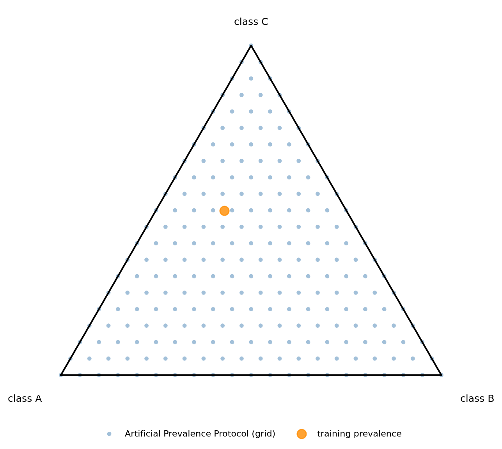
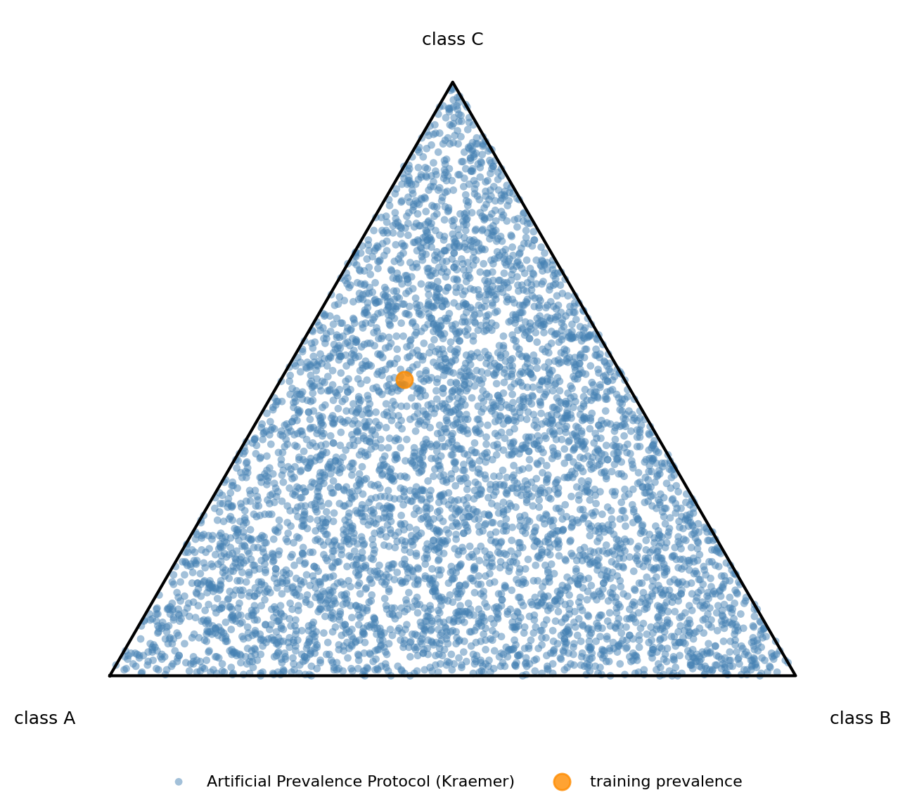
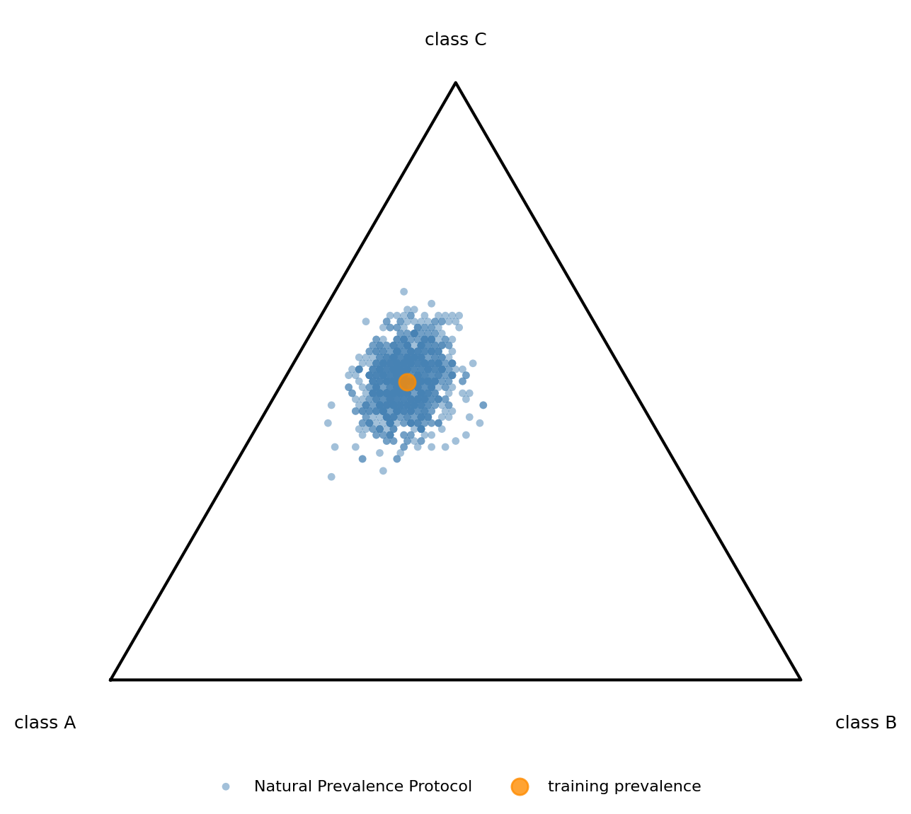
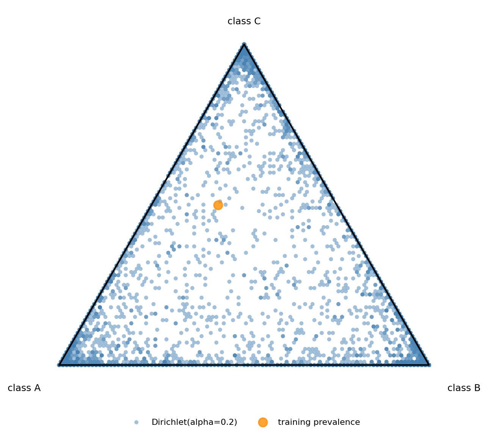

# Protocols

Quantification methods are expected to behave robustly in the presence of 
shift. For this reason, quantification methods need to be confronted with
samples exhibiting widely varying amounts of shift. 
_Protocols_ implement specific ways for generating such samples.

In QuaPy, a protocol is an instance of _AbstractProtocol_ implementing a 
_call_ method that returns a generator yielding a tuple _(sample, prev)_
every time. The protocol can also implement the function _total()_ informing
of the number of total samples that the protocol generates.

Protocols can inherit from _AbstractStochasticSeededProtocol_, the class of
protocols that generate samples stochastically, but that can be set with 
a seed in order to allow for replicating the exact same samples. This is important
for evaluation purposes, since we typically require all our methods be evaluated
on the exact same test samples in order to allow for a fair comparison.
Indeed, the seed is set by default to 0, since this is the most commonly
desired behaviour. Indicate _radom_state=None_ for allowing different sequences of samples to be
generated every time the protocol is invoked.

Protocols that also inherit from _OnLabelledCollectionProtocol_ are such that
samples are generated from a _LabelledCollection_ object (e.g., a test collection,
or a validation collection). These protocols also allow for generating sequences of
_LabelledCollection_ instead of _(sample, prev)_ by indicating 
_return_type='labelled_collection'_ instead of the default value _return_type='sample_prev'_.

For a more technical explanation on _AbstractStochasticSeededProtocol_ and 
_OnLabelledCollectionProtocol_, see the "custom_protocol.py" provided in the
example folder. 

QuaPy provides implementations of most popular sample generation protocols
used in literature. This is the subject of the following sections.


## APP: Artificial-Prevalence Protocol

The "artificial-sampling protocol" (APP) proposed by 
[Forman (2005)](https://link.springer.com/chapter/10.1007/11564096_55)
is likely the most popular protocol used for quantification evaluation.
In APP, a test set is used to generate samples at
desired prevalence values covering the full spectrum. 

In APP, the user specifies the number
of (equally distant) points to be generated from the interval [0,1];
in QuaPy this is achieved by setting _n_prevalences_.
For example, if _n_prevalences=11_ then, for each class, the prevalence values
[0., 0.1, 0.2, ..., 1.] will be used. This means that, for two classes,
the number of different prevalence values will be 11 (since, once the prevalence
of one class is determined, the other one is constrained). For 3 classes,
the number of valid combinations can be obtained as 11 + 10 + ... + 1 = 66.
In general, the number of valid combinations that will be produced for a given
value of _n_prevalences_ can be consulted by invoking 
_num_prevalence_combinations_, e.g.:

```python
import quapy.functional as F
n_prevalences = 21
n_classes = 4
n = F.num_prevalence_combinations(n_prevalences, n_classes, n_repeats=1)
```

in this example, _n=1771_. Note the last argument, _n_repeats_, that
informs of the number of examples that will be generated for any 
valid combination (typical values are, e.g., 1 for a single sample,
or 10 or higher for computing standard deviations of performing statistical
significance tests).

One can instead work the other way around, i.e., one could decide for a 
maximum budged of evaluations and get the number of prevalence points that
will give rise to a number of evaluations close, but not higher, than
this budget. This can be achieved with the function
_get_nprevpoints_approximation_, e.g.:

```python
budget = 5000
n_prevalences = F.get_nprevpoints_approximation(budget, n_classes, n_repeats=1)
n = F.num_prevalence_combinations(n_prevalences, n_classes, n_repeats=1)
print(f'by setting n_prevalences={n_prevalences} the number of evaluations for {n_classes} classes will be {n}')
```
this will produce the following output:
```
by setting n_prevalences=30 the number of evaluations for 4 classes will be 4960
```

The following code shows an example of usage of APP for model selection 
and evaluation:

```python
import quapy as qp
from quapy.method.aggregative import ACC
from quapy.protocol import APP
import numpy as np
from sklearn.linear_model import LogisticRegression

qp.environ['SAMPLE_SIZE'] = 100
qp.environ['N_JOBS'] = -1

# define an instance of our custom quantifier
quantifier = ACC(LogisticRegression())

# load the IMDb dataset
train, test = qp.datasets.fetch_reviews('imdb', tfidf=True, min_df=5).train_test

# model selection
train, val = train.split_stratified(train_prop=0.75)
Xtr, ytr = train.Xy
quantifier = qp.model_selection.GridSearchQ(
    quantifier, 
    param_grid={'classifier__C': np.logspace(-2, 2, 5)}, 
    protocol=APP(val)  # <- this is the protocol we use for generating validation samples
).fit(Xtr, ytr)

# default values are n_prevalences=21, repeats=10, random_state=0; this is equialent to:
# val_app = APP(val, n_prevalences=21, repeats=10, random_state=0)
# quantifier = GridSearchQ(quantifier, param_grid, protocol=val_app).fit(Xtr, ytr)

# evaluation with APP
mae = qp.evaluation.evaluate(quantifier, protocol=APP(test), error_metric='mae')
print(f'MAE = {mae:.4f}')
```

Note that APP is an instance of _AbstractStochasticSeededProtocol_ and that the
_random_state_ is by default set to 0, meaning that all the generated validation
samples will be consistent for all the combinations of hyperparameters being tested.
Note also that the _sample_size_ is not indicated when instantiating the protocol; 
in such cases QuaPy takes the value of _qp.environ['SAMPLE_SIZE']_.

This protocol is useful for testing a quantifier under conditions of 
_prior probability shift_.

The following ternary plot, generated by [example 21](https://github.com/HLT-ISTI/QuaPy/blob/master/examples/21.visualizing_protocols.py),
shows the prevalence values covered by a grid-based APP in a three-class problem (`academic-success`):



Each point corresponds to one sampled prevalence vector. As expected, the
points lie on a regular grid over the simplex, ensuring systematic coverage of
the prevalence space.

## UPP: Sampling from the unit-simplex, the Uniform-Prevalence Protocol

Generating all possible combinations from a grid of prevalence values (APP) in 
multiclass is cumbersome, and when the number of classes increases it rapidly
becomes impractical. In some cases, it is preferable to generate a fixed number
of samples displaying prevalence values that are uniformly drawn from the unit-simplex, 
that is, so that every legitimate distribution is equally likely. The main drawback
of this approach is that we are not guaranteed that all classes have been tested
in the entire range of prevalence values. The main advantage is that every possible
prevalence value is electable (this was not possible with standard APP, since values
not included in the grid are never tested). Yet another advantage is that we can
control the computational burden every evaluation incurs, by deciding in advance
the number of samples to generate. 

The UPP protocol implements this idea by relying on the Kraemer algorithm
for sampling from the unit-simplex as many vectors of prevalence values as indicated
in the _repeats_ parameter. UPP can be instantiated as:

```python
protocol = qp.protocol.UPP(test, repeats=100)
```

This is the most convenient protocol for datasets
containing many classes; see, e.g., 
[LeQua (2022)](https://ceur-ws.org/Vol-3180/paper-146.pdf), 
and is useful for testing a quantifier under conditions of 
_prior probability shift_.

The next plot shows one such protocol, labelled in example 21 as
_APP(Kraemer)_, to emphasize that it plays the role of an artificial-prevalence
protocol without relying on a fixed grid:



Unlike grid-based APP, UPP does not force prevalence vectors to lie on a
regular lattice. Instead, it spreads samples over the simplex in a
statistically uniform way, making it attractive when the number of classes is
large and exhaustive grids become impractical.

*Note* that UPP is actually a different (modern) implementation of the Artificial Prevalence Protocol,
and is here given a different name simply to allow both implementations coexist in QuaPy. "UPP" is not a
proper accademic name, and practitioners should rather refer to it as APP. 

## Natural-Prevalence Protocol 

The "natural-prevalence protocol" (NPP) comes down to generating samples drawn 
uniformly at random from the original labelled collection. This protocol has
sometimes been used in literature, although it is now considered to be deprecated,
due to its limited capability to generate interesting amounts of shift.
All other things being equal, this protocol can be used just like APP or UPP, 
and is instantiated via:

```python
protocol = qp.protocol.NPP(test, repeats=100)
```

The prevalence coverage of NPP is much more concentrated, since the samples are
obtained by plain random subsampling from the test set and therefore remain
close to its natural prevalence:



This makes NPP useful when one wants to evaluate quantifiers under mild or
realistic drift conditions, but much less suitable than APP or UPP for stress
testing performance across the full simplex.

## Dirichlet Protocol

QuaPy also implements a :class:`DirichletProtocol`, which samples prevalence
vectors from a Dirichlet distribution before drawing the corresponding sample
from the labelled collection:

```python
protocol = qp.protocol.DirichletProtocol(test, alpha=0.2, repeats=100)
```

The parameter `alpha` controls how concentrated the protocol is. Small values
of `alpha` favour sparse prevalence vectors near the corners of the simplex,
while larger values generate more balanced mixtures. When all entries of
`alpha` are equal to 1, the protocol becomes uniformly distributed over the
simplex, similarly in spirit to UPP.

The following plot shows the effect of a sparse prior with `alpha=0.2`:



Compared to UPP, the mass is clearly pulled towards the vertices and edges,
thus producing more extreme label-shift scenarios.

The parameter `alpha` in the Dirichlet distribution is typically defined as an 
array of shape `(n_classes)`. When the user specifies a single value, QuaPy
broadcasts this value for all classes. Conversely, a different value can be
specified for each class.

## Other protocols

Other protocols exist in QuaPy and will be added to the `qp.protocol.py` module.